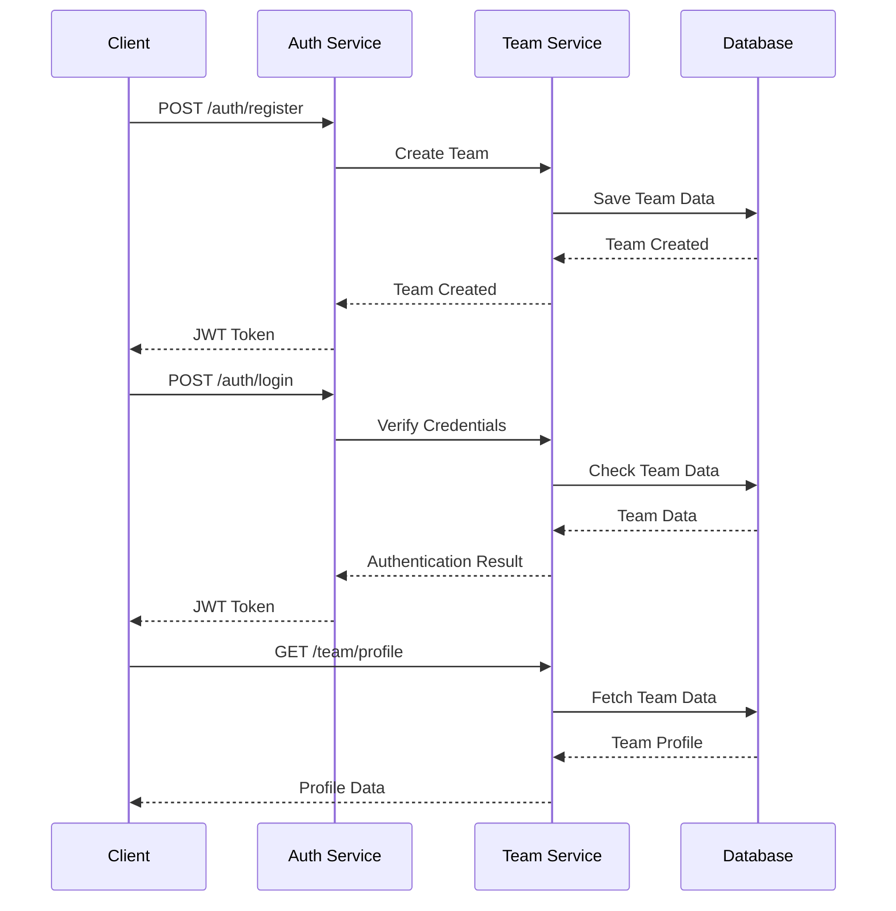
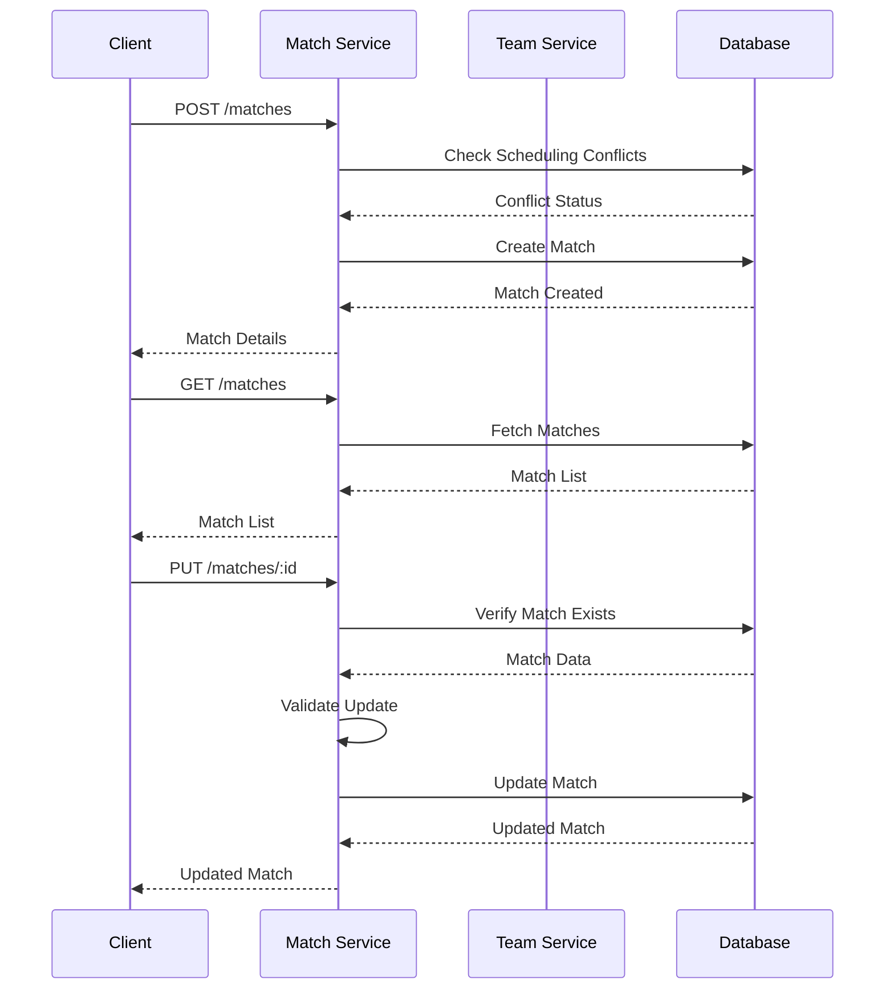
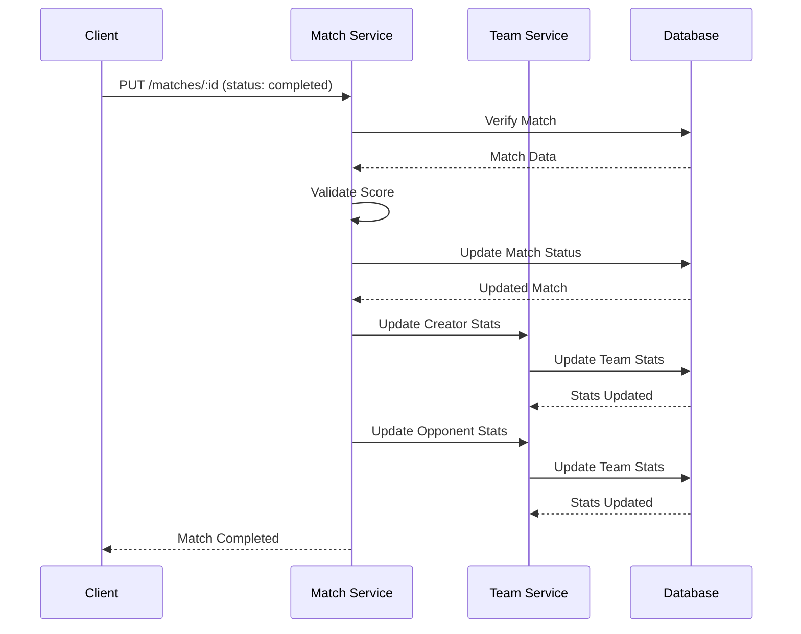

# Football Fixer - Simplified System Documentation

## Overview
The Football Fixer is a platform for managing football matches between college teams. The system has been simplified to focus on core functionalities: team management, match scheduling, and basic statistics.

## Core Components

### 1. Team Management


### 2. Match Management


### 3. Match Completion


## Data Models

### 1. Team Model
```javascript
{
    teamName: String,
    email: String,
    password: String,
    collegeName: String,
    profile: {
        bio: String,
        foundedYear: Number,
        preferredLocations: [String],
        teamSize: Number,
        skillLevel: String
    },
    statistics: {
        totalMatches: Number,
        wins: Number,
        losses: Number,
        draws: Number,
        goalsScored: Number,
        goalsConceded: Number,
        winPercentage: Number
    },
    ratings: [{
        rating: Number,
        review: String,
        reviewer: ObjectId,
        match: ObjectId,
        createdAt: Date
    }]
}
```

### 2. Match Model
```javascript
{
    creatorTeam: ObjectId,
    opponentTeam: ObjectId,
    matchTime: Date,
    location: String,
    status: String,
    score: {
        creatorTeam: Number,
        opponentTeam: Number
    },
    statistics: {
        shots: {
            creatorTeam: Number,
            opponentTeam: Number
        },
        possession: {
            creatorTeam: Number,
            opponentTeam: Number
        }
    },
    ratings: {
        creatorTeam: {
            rating: Number,
            review: String
        },
        opponentTeam: {
            rating: Number,
            review: String
        }
    }
}
```

## API Endpoints

### 1. Team Endpoints
- `POST /auth/register` - Register new team
- `POST /auth/login` - Team login
- `GET /team/profile` - Get team profile

### 2. Match Endpoints
- `GET /matches` - Get all matches
- `GET /matches/my-matches` - Get team's matches
- `POST /matches` - Create new match
- `PUT /matches/:id` - Update match

## Key Features

### 1. Team Management
- Team registration and authentication
- Profile management
- Basic statistics tracking
- Rating system

### 2. Match Management
- Match creation
- Scheduling conflict detection
- Match status updates
- Score management

### 3. Statistics
- Win/loss tracking
- Goals scored/conceded
- Win percentage calculation
- Basic match statistics

## Error Handling

### Common Error Codes
- 400: Bad Request
- 401: Unauthorized
- 403: Forbidden
- 404: Not Found
- 409: Conflict
- 500: Internal Server Error

### Error Response Format
```javascript
{
    "error": {
        "code": Number,
        "message": String,
        "details": Object
    }
}
```

## Security

### Authentication
- JWT-based authentication
- Password hashing
- Protected routes

### Authorization
- Team-based access control
- Match ownership verification
- Action validation

## Performance Considerations

### Database Operations
- Efficient queries
- Proper indexing
- Connection pooling

### Error Handling
- Comprehensive error catching
- Detailed error logging
- User-friendly error messages

## Future Enhancements

### Planned Features
1. Enhanced statistics
2. Team rankings
3. Match history
4. Advanced search

### Technical Improvements
1. Caching implementation
2. API documentation
3. Testing coverage
4. Performance optimization
