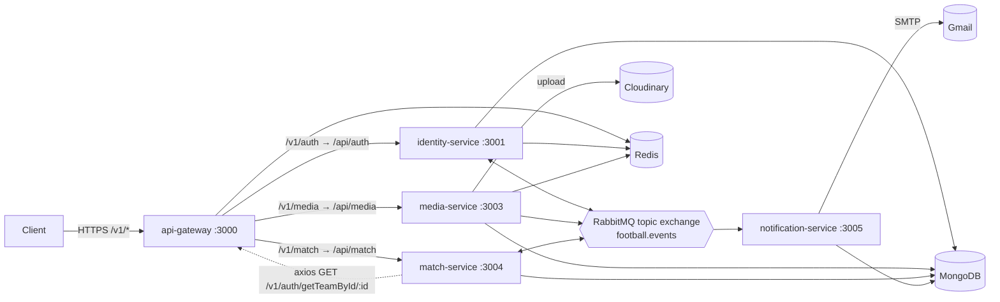
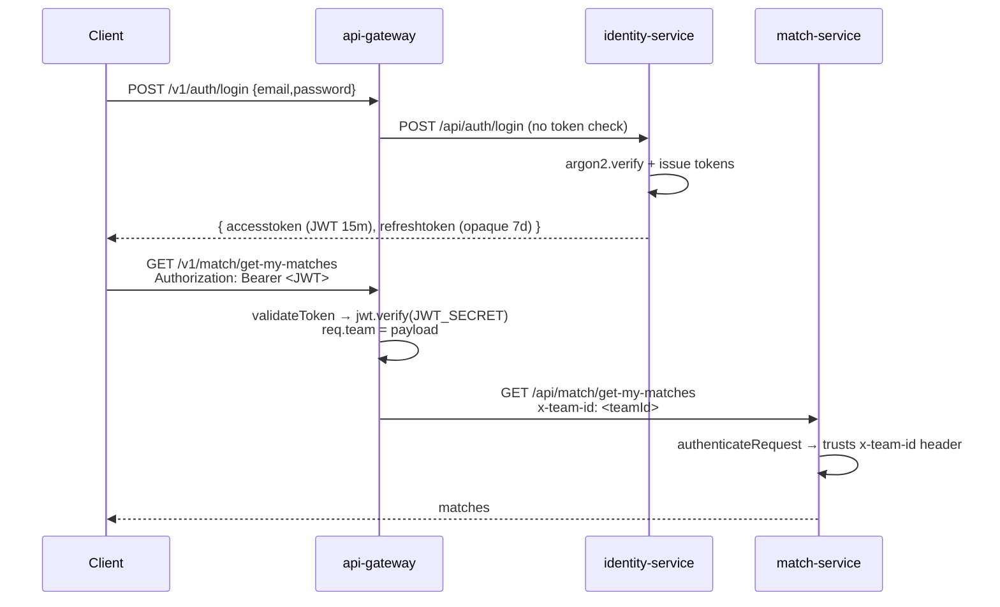
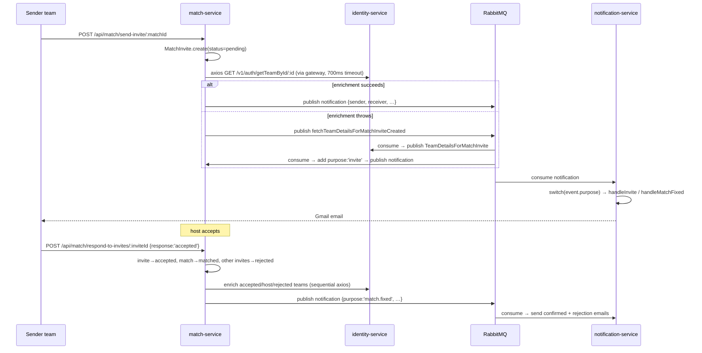

# Uni Football Fixer — Microservice Architecture Overview

> **Scope:** this document set covers the **microservice stack only** (`api-gateway`, `identity-service`,
> `match-service`, `media-service`, `notification-service`). The legacy monolith in `/src` is out of scope.
>
> **Status:** as-built snapshot of the code on `main` (commit `2e21110 — Shifted to Microservice Architecture`).
> It describes what the code *does today*, not what it should do. Known defects are recorded per service
> under "Known issues / tech debt" so they can feed the upgrade plan.

---

## 1. What the system does

Teams (representing colleges) register, upload a logo, post a **match** they want to host, and other teams
send **invites** to play that match. The host accepts one invite — the match becomes `matched`, all other
invites are auto-rejected, and everybody involved receives an email.

---

## 2. Service map

| Service | Port | Public? | Owns | Datastore | Talks to |
|---|---|---|---|---|---|
| `api-gateway` | 3000 | ✅ only public entry | nothing | Redis (rate-limit counters) | all services over HTTP |
| `identity-service` | 3001 | ❌ via gateway | `Team`, `RefreshToken` | MongoDB, Redis | RabbitMQ |
| `media-service` | 3003 | ❌ via gateway | `Media` | MongoDB, Redis, Cloudinary | RabbitMQ |
| `match-service` | 3004 | ❌ via gateway | `Match`, `MatchInvite` | MongoDB | RabbitMQ, identity via HTTP |
| `notification-service` | 3005 | ❌ no HTTP API at all | `Notification` | MongoDB, Redis | RabbitMQ, Gmail SMTP |

There is **no service discovery** — the gateway reads each target from an env var
(`IDENTITY_SERVICE_URL`, `MEDIA_SERVICE_URL`, `MATCH_SERVICE_URL`), and `match-service` hardcodes
`http://localhost:3000` for its callbacks.



---

## 3. Shared technology baseline

Every service was scaffolded from the same template, so the stack is near-identical across all five:

| Concern | Technology | Version in repo | Notes |
|---|---|---|---|
| Runtime | Node.js | Dockerfiles pin `node:18-alpine` | Node 18 is **EOL** (April 2025) |
| Module system | CommonJS (`"type": "commonjs"`) | — | `require`, no ESM, no TypeScript |
| HTTP framework | Express | `^5.1.0` (gateway + all services) | Express 5 — modern; monolith still on 4 |
| ODM | Mongoose | `^8.17.1` | ⚠️ **missing from `package.json`** in `match-service` and `notification-service` (phantom dependency resolved via npm hoisting) |
| Security headers | Helmet | `^8.1.0` | |
| CORS | `cors` | `^2.8.5` | wide-open `app.use(cors())` everywhere |
| Rate limiting | `express-rate-limit` `^8`, `rate-limit-redis` `^4`, `rate-limiter-flexible` `^7` | — | only actually **enabled** in `api-gateway` and `media-service`; commented out elsewhere |
| Redis client | `ioredis` `^5.7` **and** `redis` `^5.8` | — | both installed in most services; gateway/identity/match/notification use `ioredis`, media uses `redis` |
| Messaging | `amqplib` `^0.10.9` → RabbitMQ | — | `identity-service` also carries the dead `amqp@0.2.7` package |
| Auth | `jsonwebtoken` `^9` | — | HS256, 15-min access token |
| Password hashing | `argon2` `^0.44` | — | identity-service only |
| Validation | `joi` `^18` | — | identity-service only (media has it installed but unused) |
| Logging | `winston` `^3.17` | — | Console + `error.log` + `combined.log` **written into the service directory and committed to git** |
| Config | `dotenv` `^17` | — | per-service `.env`, gitignored |
| Containers | Dockerfile | 3 of 5 services | `match-service` and `notification-service` have **no Dockerfile**; there is **no `docker-compose.yml`** and no orchestration manifest anywhere |
| Tests | none | — | every service has `"test": "echo \"Error: no test specified\" && exit 1"` |

---

## 4. Authentication & authorization flow

This is the single most important cross-cutting mechanic to understand before any upgrade.



**The trust model:** the gateway is the *only* component that verifies a JWT. Downstream services do
**not** validate anything — `match-service` and `media-service` simply read the `x-team-id` header the
gateway injected and treat it as the authenticated identity. Anyone who can reach a service port directly
can impersonate any team by setting that header. There is no network policy, mTLS, or shared-secret check
enforcing "requests must come from the gateway".

**Token details**
- **Access token:** JWT, `{ teamId, name }`, `HS256` with `JWT_SECRET`, expires in `15m`.
  (`name` is always `undefined` — the `Team` model field is `teamName`, not `name`.)
- **Refresh token:** 64 random bytes hex, stored in the `refreshtokens` collection with a 7-day
  `expiresAt` and a MongoDB TTL index. Rotated on every refresh (old row deleted).
- **Roles:** `Team.role` is `TEAM | ADMIN`, but the role is **never put in the JWT and never checked**
  anywhere in the microservices. There is no admin surface in this stack.

---

## 5. Event bus

All asynchronous communication goes through **one RabbitMQ topic exchange**: `football.events`.
Every service ships an identical copy of `src/utils/rabbitmq.js` (`connectToRabbitMQ`, `publishEvent`,
`consumeEvent`).

```js
await channel.assertExchange('football.events', 'topic', { durable: false });
// consumer side:
const q = await channel.assertQueue('', { exclusive: true });   // anonymous, auto-delete
await channel.bindQueue(q.queue, EXCHANGE_NAME, routingKey);
```

### Routing keys in use

| Routing key | Published by | Consumed by | Payload |
|---|---|---|---|
| `profilePhoto.updated` | media-service | identity-service | `{ teamId, url }` |
| `fetchTeamDetails` | match-service | identity-service | `{ teamId, matchId }` |
| `TeamDetails` | identity-service | match-service | full `Team` doc + `matchId` |
| `fetchTeamDetailsForMatchInviteCreated` | match-service | identity-service | `{ receiverTeamId, matchId }` |
| `TeamDetailsForMatchInvite` | identity-service | match-service | `{ teamName, email, collegeName, matchId }` |
| `fetchTeamDetailsForRespondingToInvite` | match-service | identity-service | `{ matchId, inviteId, purpose, teams[] }` |
| `teamDetailsForRespondingToInvite` | identity-service | match-service | `{ matchId, inviteId, purpose, enrichedTeams[] }` |
| `notification` | match-service | notification-service | `{ purpose: 'invite' \| 'match.fixed', ... }` |

### Structural properties of this bus (all of them are problems)

1. **`durable: false` exchange + non-persistent messages** — a RabbitMQ restart drops everything in flight.
2. **Exclusive anonymous queues** — the queue is created *when the consumer connects* and deleted when it
   disconnects. Any event published while a consumer is down is **silently lost forever**. There is no
   durable queue, no dead-letter exchange, no retry.
3. **Fan-out on scale-out** — because each *instance* gets its own exclusive queue, running two replicas of
   `notification-service` means **both** process every event, so every email is sent twice. This
   architecture cannot be horizontally scaled as written.
4. **`channel.ack(msg)` runs before the async callback resolves** — the callback is not awaited, so a
   handler that throws still acks. Failures are dropped.
5. **No schema / versioning** — payload shapes are implicit and already inconsistent between the sync and
   async branches of the same flow (see `match-service` known issues).
6. **Inconsistent naming** — `PascalCase` (`TeamDetails`), `camelCase` (`teamDetailsForRespondingToInvite`)
   and `dot.case` (`profilePhoto.updated`) are all in use.

---

## 6. The two end-to-end business flows

### 6.1 Create a match

```mermaid
sequenceDiagram
    participant C as Client
    participant GW as api-gateway
    participant MT as match-service
    participant MQ as RabbitMQ
    participant ID as identity-service

    C->>GW: POST /v1/match/create-match {matchTime, location}
    GW->>MT: POST /api/match/create-match (x-team-id)
    MT->>MT: Match.create({teamId, matchTime, location})
    MT-->>C: 201 match (teamName/collegeName still empty)
    MT->>MQ: publish fetchTeamDetails {teamId, matchId}
    MQ->>ID: consume
    ID->>MQ: publish TeamDetails {…team, matchId}
    MQ->>MT: consume
    MT->>MT: match.teamName / collegeName = … ; save()
```

The denormalized `teamName`/`collegeName` on `Match` are filled in **after** the response is returned —
an eventual-consistency read-model update. The synchronous alternative exists in the code but is
commented out.

### 6.2 Send an invite → host accepts → emails go out



**Every enrichment step exists twice** — once as a synchronous HTTP call and once as an event-driven
fallback, with *different payload shapes*. This dual-path design is the main source of the bugs listed
in the per-service docs.

---

## 7. Cross-cutting known issues

These affect the whole stack and should be treated as upgrade inputs:

| # | Issue | Impact |
|---|---|---|
| 1 | Node 18 base image (EOL), no `engines` field in any service | no security patches |
| 2 | No `docker-compose.yml` / K8s manifests; 2 of 5 services have no Dockerfile | cannot run the stack reproducibly |
| 3 | Downstream services trust the `x-team-id` header unconditionally | full auth bypass if a service port is reachable |
| 4 | `winston` writes `error.log` / `combined.log` into each service dir, and **these files are committed to git** | log noise in VCS, no rotation, no central log store |
| 5 | Zero tests, zero CI | no regression safety net for the upgrade |
| 6 | No health/readiness endpoint on any service | nothing to probe |
| 7 | No tracing / correlation ID propagation (a `correlationId` is set on one event payload and never used) | flows spanning 4 hops are undebuggable |
| 8 | `rabbitmq.js`, `logger.js`, `errorHandler.js`, `authMiddleware.js` are **copy-pasted verbatim** across services | every fix must be made 5 times |
| 9 | Large blocks of commented-out code in every `server.js` (~100 lines each of dead rate-limiter config) | obscures actual behaviour |
| 10 | `mongoose` used but not declared in `match-service` / `notification-service` | breaks under `npm ci` in an isolated container |
| 11 | No graceful shutdown — no `SIGTERM` handler, no connection draining, RabbitMQ channel never closed | in-flight requests killed on deploy |
| 12 | `process.on('unhandledRejection')` logs but does not exit; there is no `uncaughtException` handler | silent zombie states |

---

## 8. Per-service documents

| Doc | Service |
|---|---|
| [01-api-gateway.md](./01-api-gateway.md) | `api-gateway` |
| [02-identity-service.md](./02-identity-service.md) | `identity-service` |
| [03-match-service.md](./03-match-service.md) | `match-service` |
| [04-media-service.md](./04-media-service.md) | `media-service` |
| [05-notification-service.md](./05-notification-service.md) | `notification-service` |
