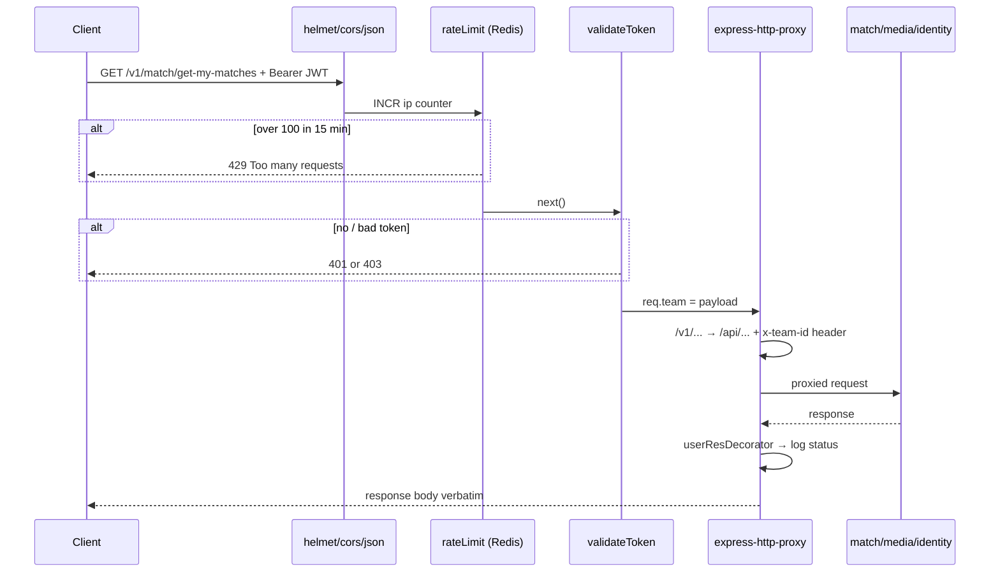

# `api-gateway`

The single public entry point. Terminates client requests, enforces rate limits, verifies the JWT, and
reverse-proxies to the internal services after rewriting the path and injecting the team identity.

It owns **no database and no domain logic**.

---

## 1. Tech stack

| Layer | Package | Version | Role |
|---|---|---|---|
| Runtime | Node.js | `node:18-alpine` (Dockerfile) | EOL runtime |
| HTTP | `express` | `^5.1.0` | app framework |
| Reverse proxy | `express-http-proxy` | `^2.1.1` | per-route proxying with path rewrite |
| Security headers | `helmet` | `^8.1.0` | |
| CORS | `cors` | `^2.8.5` | `app.use(cors())` — all origins |
| Rate limiting | `express-rate-limit` | `^8.0.1` | 100 req / 15 min per IP |
| Rate-limit store | `rate-limit-redis` | `^4.2.2` | shared counters across replicas |
| Redis client | `ioredis` | `^5.7.0` | `REDIS_URL` |
| Auth | `jsonwebtoken` | `^9.0.2` | `jwt.verify` with `JWT_SECRET` |
| Logging | `winston` | `^3.17.0` | console + `error.log` + `combined.log` |
| Config | `dotenv` | `^17.2.1` | |
| Dev | `nodemon` | `^3.1.10` | |

**No** database client, **no** `amqplib`. The gateway is purely synchronous.

---

## 2. Directory structure

```
api-gateway/
├── Dockerfile              # node:18-alpine, npm ci --only=production, EXPOSE 3000
├── package.json
└── src/
    ├── server.js           # everything: middleware chain + proxy routes + listen
    ├── middleware/
    │   ├── authMiddleware.js   # validateToken
    │   └── errorhandler.js
    └── utils/
        └── logger.js       # winston
```

There is no `app.js` / `server.js` split — `server.js` builds the app *and* listens.

---

## 3. Startup & middleware order

`src/server.js` executes top to bottom:

```
1. dotenv.config()
2. new Redis(process.env.REDIS_URL)
3. helmet()
4. cors()
5. express.json()
6. rateLimit({ 100 / 15min, store: RedisStore })   ← global, applies to every route
7. request logger (method, url, body)
8. app.set('trust proxy', 1)                        ← registered AFTER the rate limiter
9. proxy routes  (/v1/auth, /v1/media, /v1/match)
10. errorHandler
11. app.listen(PORT ?? 3000)
```

---

## 4. Routing table

All routes share `proxyOptions`, whose only job is the path rewrite:

```js
proxyReqPathResolver: (req) => req.originalUrl.replace(/^\/v1/, '/api')
```

| Public route | JWT required | Target env var | Rewritten to | Extra headers injected |
|---|---|---|---|---|
| `/v1/auth/*` | ❌ no | `IDENTITY_SERVICE_URL` | `/api/auth/*` | `Content-Type: application/json` |
| `/v1/media/*` | ✅ `validateToken` | `MEDIA_SERVICE_URL` | `/api/media/*` | `x-team-id`; `Content-Type: application/json` **unless** the request is `multipart/form-data` |
| `/v1/match/*` | ✅ `validateToken` | `MATCH_SERVICE_URL` | `/api/match/*` | `x-team-id`; `Content-Type: application/json` |

Two further proxies are present but **commented out**: `/v1/posts` → `POST_SERVICE_URL` and
`/v1/search` → `SEARCH_SERVICE_URL`. Those services do not exist in the repo.

Note that `/v1/auth/*` is entirely unauthenticated — which includes
`GET /v1/auth/getTeamById/:teamId` (see identity-service).

---

## 5. `validateToken` — the auth boundary

`src/middleware/authMiddleware.js`:

```js
const token = req.headers['authorization']?.split(' ')[1];
if (!token)  → 401 'Authentication required ! Please Login to continue'
jwt.verify(token, process.env.JWT_SECRET, (err, team) => {
    if (err) → 403 'Invalid token'
    req.team = team;      // { teamId, name, iat, exp }
    next();
});
```

`req.team.teamId` is then copied into the `x-team-id` request header for the downstream service.
**This is the only JWT verification in the entire system.**

---

## 6. Request flow



On a proxy transport error, `proxyErrorHandler` logs and returns a flat
`500 { message: 'Internal Server Error' }` — the upstream status code is not preserved.

---

## 7. Configuration (`.env`)

| Variable | Used for |
|---|---|
| `PORT` | listen port (default `3000`) |
| `REDIS_URL` | rate-limit counter store |
| `JWT_SECRET` | must match identity-service's signing secret |
| `IDENTITY_SERVICE_URL` | proxy target |
| `MEDIA_SERVICE_URL` | proxy target |
| `MATCH_SERVICE_URL` | proxy target |
| `NODE_ENV` | switches winston level `info` / `debug` |

`notification-service` has no gateway route — it is event-only and has no HTTP API.

---

## 8. Known issues / tech debt

| # | Issue | Where | Impact |
|---|---|---|---|
| 1 | `app.set('trust proxy', 1)` is called **after** `rateLimit` is registered | `server.js:53` | behind a load balancer the limiter may key on the proxy IP, so all users share one bucket (or `express-rate-limit` v8 may reject the config outright) |
| 2 | `srcReq.headers['content-type'].startsWith(...)` with no guard | `server.js:104` | any `GET`/`DELETE` to `/v1/media/*` (no `Content-Type` header) throws `TypeError: Cannot read properties of undefined` |
| 3 | Rate limit is global (`app.use`), including `/v1/auth/login` | `server.js:45` | login/register share the same generous 100/15min bucket as everything else — no stricter limit on credential endpoints |
| 4 | `logger.info(\`Request Body ${req.body}\`)` | `server.js:49` | always prints `[object Object]`; if it were fixed it would log **plaintext passwords** from `/v1/auth/login` |
| 5 | Proxy errors collapse to `500` | `server.js:60-63` | upstream `4xx` on connection failure is indistinguishable from a real server error |
| 6 | `cors()` with no options | `server.js:24` | every origin allowed, credentials disabled |
| 7 | No `/health` or `/ready` endpoint | — | nothing for a container orchestrator to probe |
| 8 | Hard-coded service URLs come from env with no fallback or validation | `server.js:67+` | `undefined` target silently produces cryptic proxy errors at request time, not boot time |
| 9 | No request/correlation ID generated | — | a request that fans out to 3 services cannot be traced |
| 10 | Winston writes log files into the container working directory, and both are committed to git | `utils/logger.js` | unbounded disk growth, no rotation |
| 11 | `Dockerfile` uses `npm ci --only=production` (deprecated flag) on `node:18-alpine` | `Dockerfile` | EOL base image; flag replaced by `--omit=dev` |
| 12 | Response bodies are buffered by `userResDecorator` | all proxies | streaming/large uploads are fully materialised in gateway memory |
