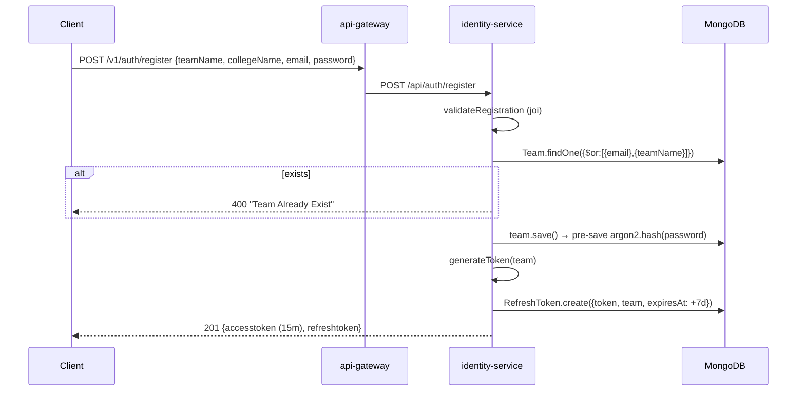
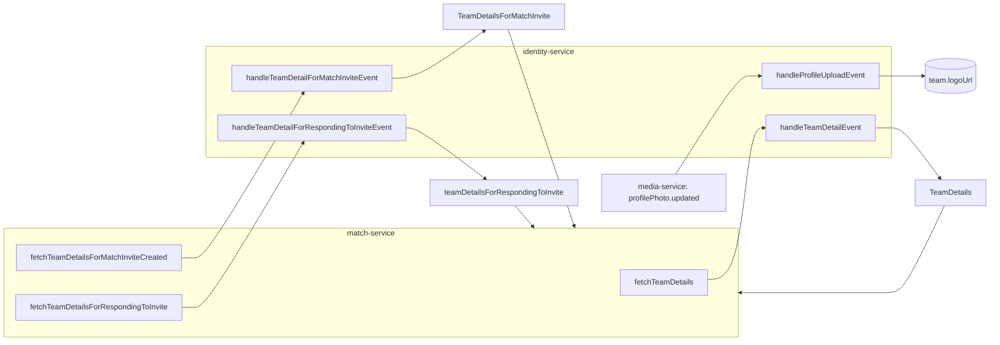

# `identity-service`

Owns team accounts and the token lifecycle. It is also the **read model of record for team data** — the
other services hold denormalized copies of `teamName` / `collegeName` / `email` and ask this service to
refresh them, either over HTTP or over RabbitMQ.

Port: `3001` (`PORT ?? 3001`). Reached only via the gateway at `/v1/auth/*` → `/api/auth/*`.

---

## 1. Tech stack

| Layer | Package | Version | Role |
|---|---|---|---|
| Runtime | Node.js | `node:18-alpine` (Dockerfile) | EOL |
| HTTP | `express` | `^5.1.0` | |
| ODM | `mongoose` | `^8.17.1` | MongoDB |
| Password hashing | `argon2` | `^0.44.0` | `pre('save')` hook + `comparePassword` |
| Tokens | `jsonwebtoken` | `^9.0.2` | HS256 access token |
| Refresh tokens | `crypto` (stdlib) | — | 64 random bytes, stored in Mongo |
| Validation | `joi` | `^18.0.0` | register / login body schemas |
| Messaging | `amqplib` | `^0.10.9` | topic exchange `football.events` |
| Messaging (dead) | `amqp` | `^0.2.7` | **unused legacy package, remove** |
| Redis | `ioredis` `^5.7.0` + `redis` `^5.8.2` | | two clients installed, one used, for a feature that is disabled |
| Rate limiting | `rate-limiter-flexible` `^7.2.0`, `express-rate-limit` `^8.0.1`, `rate-limit-redis` `^4.2.1` | | **all commented out** |
| Headers / CORS | `helmet` `^8.1.0`, `cors` `^2.8.5` | | |
| Logging | `winston` | `^3.17.0` | |
| Config | `dotenv` | `^17.2.1` | |

---

## 2. Directory structure

```
identity-service/
├── Dockerfile
├── package.json
└── src/
    ├── server.js                       # bootstrap + consumer registration
    ├── routes/
    │   └── identity-service.js         # /api/auth router
    ├── controllers/
    │   └── identitty-controller.js     # [sic] registration, login, refresh, logout, getTeamById
    ├── models/
    │   ├── Team.js
    │   └── RefreshToken.js
    ├── eventHandlers/
    │   └── identity-event-handlers.js  # 4 RabbitMQ consumers
    ├── middleware/
    │   ├── authMiddleware.js           # exports authenticateRequest — imported by the router but never applied
    │   └── errorHandler.js
    └── utils/
        ├── generateToken.js
        ├── validation.js               # joi schemas
        ├── rabbitmq.js                 # copy-pasted across services
        └── logger.js
```

---

## 3. Boot sequence (`src/server.js`)

```
1.  dotenv.config()
2.  mongoose.connect(MONGODB_URL)          ← fire-and-forget, failure only logged
3.  new Redis({ url: REDIS_URL })          ← ⚠️ ioredis ignores an options object with a `url` key
4.  helmet(), cors(), express.json(), request logger
5.  RateLimiterRedis instance created ... and never used (the app.use is commented out)
6.  app.use('/api/auth', identityroutes)
7.  app.use(errorHandler)
8.  startServer():
      await connectToRabbitMQ()
      consumeEvent('profilePhoto.updated',                    handleProfileUploadEvent)
      consumeEvent('fetchTeamDetails',                        handleTeamDetailEvent)
      consumeEvent('fetchTeamDetailsForMatchInviteCreated',   handleTeamDetailForMatchInviteEvent)
      consumeEvent('fetchTeamDetailsForRespondingToInvite',   handleTeamDetailForRespondingToInviteEvent)
      app.listen(PORT ?? 3001)
```

Only the RabbitMQ connection is awaited before `listen`; Mongo and Redis connect in the background, so
the service accepts traffic before its database is ready.

---

## 4. Data model

### `Team` (`teams`)

| Field | Type | Constraints |
|---|---|---|
| `teamName` | String | required, trimmed, **text index** |
| `collegeName` | String | required, trimmed |
| `email` | String | required, **unique**, lowercased, trimmed |
| `password` | String | required — argon2 hash, set by `pre('save')` when modified |
| `logoUrl` | String | optional — written by the `profilePhoto.updated` consumer |
| `role` | String | enum `TEAM \| ADMIN`, default `TEAM` |
| `createdAt` | Date | default `Date.now` — **redundant**, `timestamps: true` is also on |

Methods: `comparePassword(plain)` → `argon2.verify`.

### `RefreshToken` (`refreshtokens`)

| Field | Type | Constraints |
|---|---|---|
| `token` | String | required, unique — 64-byte hex |
| `team` | ObjectId → `Team` | required |
| `expiresAt` | Date | required, **TTL index** `expireAfterSeconds: 0` |

Mongo's TTL monitor deletes expired rows automatically (runs ~every 60s).

---

## 5. HTTP API (`/api/auth`, public as `/v1/auth`)

| Method | Path | Auth | Handler | Behaviour |
|---|---|---|---|---|
| `POST` | `/register` | none | `registration` | joi-validate → reject if `email` **or** `teamName` exists → save (argon2 hash in hook) → issue tokens → `201 { message, accesstoken, refreshtoken }` |
| `POST` | `/login` | none | `loginUser` | joi-validate → find by email → `comparePassword` → issue tokens → `200 { accesstoken, refreshtoken, team, message }` |
| `POST` | `/refresh-token` | none | `refreshTokenUser` | look up stored token, check `expiresAt`, load team, mint new pair, delete old row |
| `POST` | `/logout` | none | `logoutUser` | `RefreshToken.deleteOne({ token })` → `200` |
| `GET` | `/getTeamById/:teamId` | **none** | `getTeamById` | `Team.findById()` → returns the **entire document** |

### Registration / login sequence



### `generateToken` (`utils/generateToken.js`)

```js
accesstoken  = jwt.sign({ teamId: team._id, name: team.name }, JWT_SECRET, { expiresIn: '15m' })
refreshtoken = crypto.randomBytes(64).toString('hex')     // stored, expires in 7 days
```

`team.name` does not exist on the schema (`teamName` does), so `name` is always `undefined` in the JWT.

---

## 6. Event handlers

All four are registered in `server.js` and live in `eventHandlers/identity-event-handlers.js`.

| Consumes | Handler | Does | Publishes |
|---|---|---|---|
| `profilePhoto.updated` | `handleProfileUploadEvent` | `{teamId, url}` → sets `team.logoUrl = url`, saves | — |
| `fetchTeamDetails` | `handleTeamDetailEvent` | loads the team, attaches `matchId` | `TeamDetails` (the **whole** team doc, including the argon2 hash) |
| `fetchTeamDetailsForMatchInviteCreated` | `handleTeamDetailForMatchInviteEvent` | loads team with `.select('teamName email collegeName')`, attaches `matchId` | `TeamDetailsForMatchInvite` |
| `fetchTeamDetailsForRespondingToInvite` | `handleTeamDetailForRespondingToInviteEvent` | loops `teams[{teamId, role}]`, enriches each with `email/collegeName/teamName`, per-team error captured as `{teamId, role, error}` | `teamDetailsForRespondingToInvite` `{matchId, inviteId, purpose, enrichedTeams[]}` |



Note the asymmetry: `handleTeamDetailEvent` publishes the **full** team document (password hash included)
onto the shared exchange, while `handleTeamDetailForMatchInviteEvent` correctly projects only three fields.

---

## 7. Configuration (`.env`)

| Variable | Used for |
|---|---|
| `PORT` | default `3001` |
| `MONGODB_URL` | mongoose connection |
| `REDIS_URL` | rate limiter (currently disabled) |
| `RABBITMQ_URL` | amqplib connection |
| `JWT_SECRET` | access-token signing — must equal the gateway's |
| `NODE_ENV` | winston level |

---

## 8. Known issues / tech debt

| # | Issue | Where | Impact |
|---|---|---|---|
| 1 | **`GET /getTeamById/:teamId` is unauthenticated and returns the full document — including the argon2 `password` hash** | `identitty-controller.js:149-164` + gateway leaves `/v1/auth/*` open | anyone on the internet can enumerate team IDs and harvest password hashes and emails |
| 2 | `handleTeamDetailEvent` publishes the full team doc (password hash) onto `football.events` | `identity-event-handlers.js:41-45` | secrets fan out to every consumer bound to the exchange |
| 3 | `Team.findOne(storedToken.team)` in the refresh flow — an ObjectId passed as a *filter object* | `identitty-controller.js:105` | should be `findById`; behaviour is undefined/incorrect, refresh is effectively broken |
| 4 | Error branch of `getTeamById` references an undeclared `id` | `identitty-controller.js:161` | throws `ReferenceError` inside the catch, so the client gets a hung/500 with no log |
| 5 | Refresh tokens are stored **in plaintext** | `RefreshToken.js` | DB read = account takeover for 7 days |
| 6 | `logoutUser` deletes only the presented refresh token | `identitty-controller.js:130` | no "log out everywhere"; the 15-min access token stays valid after logout (no denylist) |
| 7 | All rate limiting is commented out — including on `/login` and `/register` | `server.js:77-148` | unlimited credential stuffing (only the gateway's global 100/15min applies) |
| 8 | `new Redis({ url: REDIS_URL })` — `ioredis` expects a connection string or `{host, port}`, not `{url}` | `server.js:41` | silently connects to `localhost:6379` instead of the configured Redis |
| 9 | `authenticateRequest` is imported in `routes/identity-service.js` but never applied to any route | `routes/identity-service.js:4` | dead import; no route in this service is protected |
| 10 | Password policy is `min(6)` with no complexity rule; joi `max(100)` on password | `utils/validation.js` | weak passwords accepted |
| 11 | Registration rejects on duplicate `teamName` but `teamName` has **no unique index** | `Team.js` | race condition allows duplicate team names |
| 12 | `role` exists on the model but is never issued in the JWT nor checked anywhere | — | authorization is effectively absent |
| 13 | Dead dependency `amqp@0.2.7` alongside `amqplib` | `package.json:19` | confusion + install weight |
| 14 | Typo'd filename `identitty-controller.js` | — | cosmetic but pervasive in imports |
| 15 | `logger.info(\`Request Body ${req.body}\`)` on every request | `server.js:65` | would log plaintext passwords if the interpolation is ever fixed |
| 16 | Mongo/Redis connection failures are logged but the process still serves traffic | `server.js:27-52` | requests fail at runtime instead of the container failing to start |
| 17 | ~100 lines of commented-out rate-limiter experiments | `server.js:77-166` | noise |
