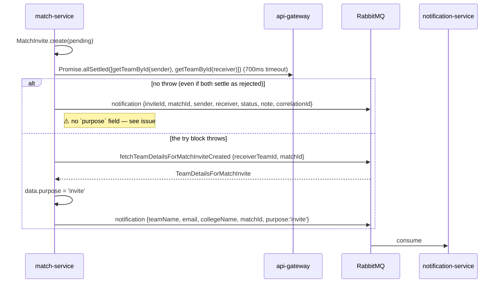
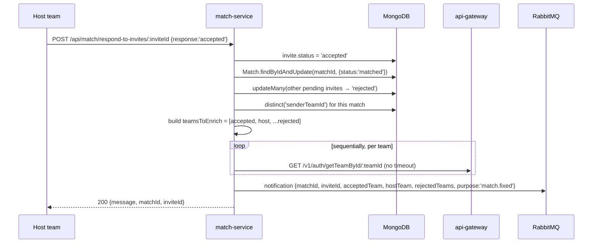

# `match-service`

The domain core. Owns hosted **matches** and the **invite** workflow (challenge → accept → auto-reject the
rest), and is the only publisher of `notification` events.

Port: `3004` (`PORT ?? 3004`). Reached via the gateway at `/v1/match/*` → `/api/match/*`.

---

## 1. Tech stack

| Layer | Package | Version | Role |
|---|---|---|---|
| Runtime | Node.js | **no Dockerfile in this service** | |
| HTTP | `express` | `^5.1.0` | |
| ODM | `mongoose` | ⚠️ **used but NOT in `package.json`** | resolves only via npm hoisting from the repo root |
| HTTP client | `axios` | `^1.11.0` | synchronous enrichment calls back through the gateway |
| Messaging | `amqplib` | `^0.10.9` | 4 publishers, 3 consumers |
| Redis | `ioredis` `^5.7.0` + `redis` `^5.8.2` | | for a rate limiter that is commented out |
| Rate limiting | `rate-limiter-flexible` `^7.3.0`, `express-rate-limit` `^8.0.1`, `rate-limit-redis` `^4.2.2` | | **all commented out** |
| Headers / CORS | `helmet` `^8.1.0`, `cors` `^2.8.5` | | |
| Auth | `jsonwebtoken` `^9.0.2` | | **installed but never used** — auth here is header-trust only |
| Proxy | `express-http-proxy` `^2.1.1` | | **installed but never used** |
| Logging | `winston` `^3.17.0` | | |
| Config | `dotenv` `^17.2.1` | | |

---

## 2. Directory structure

```
match-service/
├── package.json                        # ⚠️ no mongoose, no Dockerfile alongside
└── src/
    ├── server.js                       # bootstrap + consumer registration
    ├── routes/
    │   ├── matchRoutes.js              # /api/match  (matches)
    │   └── inviteRoutes.js             # /api/match  (invites — same mount point)
    ├── controllers/
    │   ├── match-Controller.js
    │   └── match-Invite-Controller.js
    ├── models/
    │   ├── Match.js
    │   └── MatchInvite.js
    ├── eventHandlers/
    │   └── match-event-handlers.js     # 3 RabbitMQ consumers
    ├── middleware/
    │   ├── authMiddleware.js           # authenticateRequest — trusts x-team-id
    │   └── errorHandler.js
    └── utils/
        ├── rabbitmq.js
        └── logger.js
```

---

## 3. Boot sequence (`src/server.js`)

```
1.  dotenv.config()
2.  mongoose.connect(MONGODB_URL)            ← not awaited
3.  new Redis({ url: REDIS_URL })            ← same ioredis misuse as identity-service
4.  helmet(), cors(), express.json(), request logger
5.  app.use(authenticateRequest)             ← GLOBAL: every route requires x-team-id
6.  app.use('/api/match', inviteRoutes)
7.  app.use('/api/match', matchroutes)       ← both routers on the same prefix
8.  app.use(errorHandler)
9.  startServer():
      await connectToRabbitMQ()
      consumeEvent('TeamDetails',                        handleTeamDetailEvent)
      consumeEvent('TeamDetailsForMatchInvite',          handleTeamDetailForMatchInviteEvent)
      consumeEvent('teamDetailsForRespondingToInvite',   handleTeamDetailForRespondingToInviteEvent)
      app.listen(PORT ?? 3004)
```

`authenticateRequest` is applied **before** the routers, so *every* endpoint — including the
"public display board" `get-matches` — requires an `x-team-id` header.

---

## 4. Data model

### `Match` (`matches`)

| Field | Type | Notes |
|---|---|---|
| `teamId` | **String** | the host team's id from identity-service — *not* an ObjectId ref |
| `teamName` | String | denormalized cache, filled asynchronously |
| `collegeName` | String | denormalized cache, filled asynchronously |
| `matchTime` | Date | required |
| `location` | String | required |
| `status` | String | enum `open \| matched \| cancelled \| completed`, default `open` |
| `createdAt` | Date | default `Date.now` (no `timestamps: true` on this schema) |

### `MatchInvite` (`matchinvites`)

| Field | Type | Notes |
|---|---|---|
| `senderTeamId` | **String** | challenger |
| `receiverTeamId` | **String** | host (copied from `match.teamId`) |
| `matchId` | ObjectId → `Match` | required — the only real ref in the service |
| `status` | String | enum `pending \| accepted \| rejected \| expired`, default `pending` |
| `sentAt` | Date | default `Date.now` |
| `respondedAt` | Date | **declared but never written** |

Unique compound index: `{ senderTeamId: 1, matchId: 1 }` — one invite per team per match.

The service deliberately stores foreign identities as opaque strings rather than refs, which is correct
for a microservice boundary. Note `Match` has no index on `teamId` or `status` despite both being the
primary query fields.

---

## 5. HTTP API

Both routers mount at `/api/match`. Invite routes are registered first, so they match before
`matchRoutes`' catch-all `GET /:id`.

### Invites (`inviteRoutes.js` → `match-Invite-Controller.js`)

| Method | Path | Handler | Behaviour |
|---|---|---|---|
| `POST` | `/send-invite/:matchId` | `createInvite` | load match → derive `receiverTeamId = match.teamId` → block self-challenge (`403`) → `MatchInvite.create(pending)` → enrich + publish `notification` → `201 invite` |
| `POST` | `/respond-to-invites/:inviteId` | `respondToInvite` | only the receiver may respond (`403`), only `pending` (`409`), only `response === 'accepted'` (`400`) → accept → match `matched` → all other pending invites → `rejected` → enrich → publish `notification` |
| `GET` | `/get-all-invites/` | `getIncomingInvites` | `find({receiverTeamId: me}).populate('matchId')` |
| `GET` | `/get-outgoing-invites/` | `getOutgoingInvites` | `find({senderTeamId: me}).populate('matchId')` |

### Matches (`matchRoutes.js` → `match-Controller.js`)

| Method | Path | Handler | Behaviour |
|---|---|---|---|
| `POST` | `/create-match` | `createMatch` | `Match.create({teamId, matchTime, location})` → publish `fetchTeamDetails` → `201` |
| `GET` | `/get-matches` | `getAllMatches` | `Match.find()` — unfiltered, unpaginated, all statuses |
| `GET` | `/get-my-matches/` | `getMyMatches` | `Match.find({teamId: x-team-id})` |
| `GET` | `/:id` | `getMatchById` | `Match.findById` |

### Auth

`middleware/authMiddleware.js`:

```js
const teamId = req.headers['x-team-id'];
if (!teamId) return 401;
req.team = { teamId };
next();
```

No signature, no expiry, no issuer check. The gateway is assumed to be the only caller.

---

## 6. The enrichment pattern (the defining design of this service)

`match-service` needs team names and emails that live in `identity-service`. It implements **two
independent mechanisms for the same thing**, with different payload shapes:

- **Path A — synchronous:** `axios.get('http://localhost:3000/v1/auth/getTeamById/:id')`
  (hardcoded, points at the **gateway**, not the service).
- **Path B — asynchronous fallback:** publish a `fetch…` event, identity-service answers with a
  `…Details` event, a local consumer finishes the job.

### 6.1 `createMatch`

```mermaid
sequenceDiagram
    participant C as Client
    participant MT as match-service
    participant MQ as RabbitMQ
    participant ID as identity-service

    C->>MT: POST /api/match/create-match
    MT->>MT: Match.create({teamId, matchTime, location})
    MT-->>C: 201 (teamName/collegeName undefined)
    MT->>MQ: fetchTeamDetails {teamId, matchId}
    MQ->>ID: handleTeamDetailEvent
    ID->>MQ: TeamDetails {…team, matchId}
    MQ->>MT: handleTeamDetailEvent → match.teamName/collegeName = … ; save()
```

Here Path A is *entirely commented out*, so the async path always runs.

### 6.2 `createInvite`



### 6.3 `respondToInvite`



The three writes (invite, match, other invites) are **not transactional** — a crash between them leaves
an accepted invite with an `open` match, or a `matched` match with other invites still `pending`.

---

## 7. Events

### Published

| Routing key | From | Payload |
|---|---|---|
| `fetchTeamDetails` | `createMatch` | `{ teamId, matchId }` |
| `fetchTeamDetailsForMatchInviteCreated` | `createInvite` (fallback) | `{ receiverTeamId, matchId }` |
| `fetchTeamDetailsForRespondingToInvite` | `respondToInvite` (fallback) | `{ matchId, inviteId, purpose:'responding.to.invites', teams:[{teamId, role}] }` |
| `notification` | `createInvite`, `respondToInvite`, and the two consumers below | see below |

### Consumed (`eventHandlers/match-event-handlers.js`)

| Routing key | Handler | Effect |
|---|---|---|
| `TeamDetails` | `handleTeamDetailEvent` | writes `teamName` / `collegeName` onto the `Match` |
| `TeamDetailsForMatchInvite` | `handleTeamDetailForMatchInviteEvent` | sets `purpose='invite'`, republishes as `notification` |
| `teamDetailsForRespondingToInvite` | `handleTeamDetailForRespondingToInviteEvent` | regroups `enrichedTeams` by role into `{acceptedTeam, hostTeam, rejectedTeams}`, sets `purpose='match.fixed'`, republishes as `notification` |

---

## 8. Configuration (`.env`)

| Variable | Used for |
|---|---|
| `PORT` | default `3004` |
| `MONGODB_URL` | mongoose |
| `REDIS_URL` | disabled rate limiter |
| `RABBITMQ_URL` | amqplib |
| — | the identity URL is **hardcoded** to `http://localhost:3000`, not configurable |

---

## 9. Known issues / tech debt

| # | Issue | Where | Impact |
|---|---|---|---|
| 1 | **`mongoose` is required but absent from `package.json`** | `package.json` | `npm ci` in a clean container produces `MODULE_NOT_FOUND`; the service only runs because of root-level hoisting |
| 2 | **No `Dockerfile`** for this service | — | cannot be containerised as-is |
| 3 | **`createInvite`'s happy path publishes a `notification` with no `purpose` field** (the line is commented out) | `match-Invite-Controller.js:98` | `notification-service` hits `default:` in its switch and logs "Unknown notification purpose" — **no invite email is ever sent when enrichment succeeds**. Only the failure path works |
| 4 | The two `notification` payload shapes for `purpose:'invite'` differ from what the consumer expects (`{hostTeam, acceptedTeam}`) | `match-Invite-Controller.js:90` vs `match-event-handlers.js:32-47` | even on the fallback path, `handleInvite` reads `hostTeam.email` on an object that has none → `TypeError`, caught and logged, no email |
| 5 | `http://localhost:3000` hardcoded for identity lookups — and it points at the **gateway**, re-entering the public edge | `match-Invite-Controller.js:66,67,210` | breaks in any container/host setup; adds a hop and consumes the gateway's rate-limit budget; those calls carry **no `Authorization` header** and only work because `/v1/auth/*` is unauthenticated |
| 6 | `Promise.allSettled` never rejects, so the `catch` fallback in `createInvite` is unreachable for enrichment failures | `match-Invite-Controller.js:65` | the intended resilience path is dead code; a failed lookup silently yields a `notification` with `teamName: undefined` |
| 7 | `note` and `idempotencyKey` are passed to `MatchInvite.create` but do not exist on the schema | `match-Invite-Controller.js:55-56` | silently dropped by strict mode; `idempotencyKey` provides no idempotency at all |
| 8 | Accept flow is three separate non-transactional writes | `match-Invite-Controller.js:171-186` | partial state on crash; no `session`/`withTransaction` |
| 9 | Sequential `await axios.get` inside a `for` loop during a request | `match-Invite-Controller.js:208-223` | response latency scales linearly with invite count; no timeout on these calls |
| 10 | The inner `try` swallows enrichment errors per team, so the outer `catch` fallback almost never fires | `match-Invite-Controller.js:203-254` | the batch async path is effectively dead |
| 11 | `authenticateRequest` applied globally means `get-matches` (documented as the "public display board") requires auth | `server.js:176` | public board is not public |
| 12 | `getAllMatches` returns every match, all statuses, unpaginated | `match-Controller.js:76-85` | unbounded response as data grows |
| 13 | No indexes on `Match.teamId` or `Match.status` | `Match.js` | full collection scans for the two hottest queries |
| 14 | `respondToInvite` only accepts `'accepted'`; there is no reject/decline endpoint and `respondedAt` is never set | `match-Invite-Controller.js:166` | a host cannot explicitly decline; invites have no audit timestamp |
| 15 | `getMatchById` returns `200` with `null` body for an unknown id | `match-Controller.js:102-112` | should be `404` |
| 16 | Two routers mounted at the same `/api/match` prefix; `GET /:id` would shadow any future invite GET route added after it | `server.js:177-178` | fragile routing |
| 17 | Invite `expired` status exists in the enum but nothing ever sets it — no TTL/scheduler | `MatchInvite.js:19` | invites live forever as `pending` |
| 18 | Unused dependencies: `jsonwebtoken`, `express-http-proxy`, both Redis clients, all three rate limiters | `package.json` | dead weight and misleading |
| 19 | `console.log` mixed with `logger` calls | `server.js:179`, `match-event-handlers.js:36` | inconsistent, unstructured output |
| 20 | ~100 lines of commented-out rate-limiter config | `server.js:79-168` | noise |
