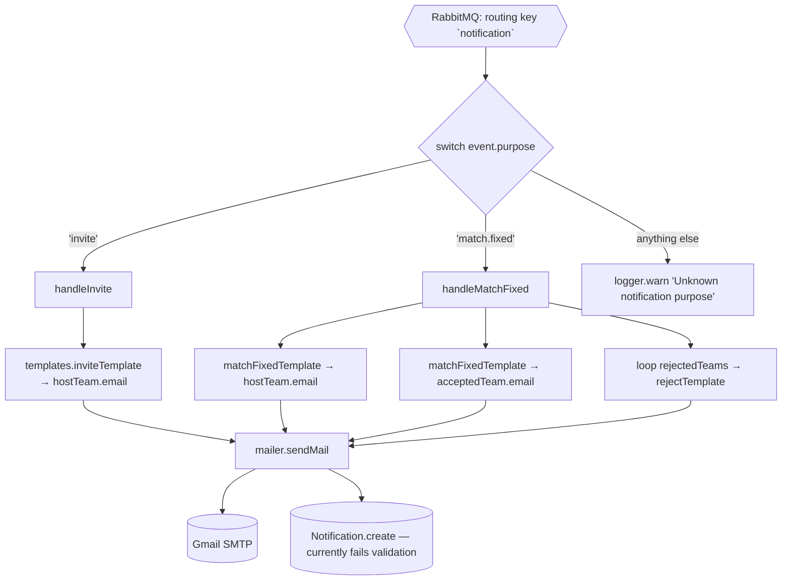

# `notification-service`

A pure event consumer. It subscribes to the single `notification` routing key, dispatches on
`event.purpose`, renders an HTML template, and sends email via Gmail SMTP.

Port: `3005` (`PORT ?? 3005`) — but it exposes **no HTTP routes at all**. The Express app exists only
because it was copy-pasted from the service template. It is not registered in the gateway.

---

## 1. Tech stack

| Layer | Package | Version | Role |
|---|---|---|---|
| Runtime | Node.js | **no Dockerfile in this service** | |
| HTTP | `express` | `^5.1.0` | listens, serves nothing |
| ODM | `mongoose` | ⚠️ **used but NOT in `package.json`** | resolves via root hoisting only |
| Email | `nodemailer` | `^7.0.6` | `service: 'gmail'` + app password |
| Messaging | `amqplib` | `^0.10.9` | consumer only |
| Redis | `ioredis` `^5.7.0` + `redis` `^5.8.2` | | for a rate limiter that is commented out |
| Rate limiting | `rate-limiter-flexible` `^7.3.0`, `express-rate-limit` `^8.0.1`, `rate-limit-redis` `^4.2.2` | | **all commented out** |
| Headers / CORS | `helmet` `^8.1.0`, `cors` `^2.8.5` | | applied to an app with zero routes |
| Unused | `axios` `^1.11.0`, `express-http-proxy` `^2.1.1`, `jsonwebtoken` `^9.0.2` | | never imported |
| Logging | `winston` `^3.17.0` | | |
| Config | `dotenv` `^17.2.1` | | |

---

## 2. Directory structure

```
notification-service/
├── package.json                        # ⚠️ no mongoose, no Dockerfile alongside
└── src/
    ├── server.js                       # bootstrap + the single consumer + dispatch switch
    ├── services/
    │   └── notificationService.js      # handleInvite, handleMatchFixed
    ├── models/
    │   └── Notification.js
    ├── middleware/
    │   ├── authMiddleware.js           # applied globally — but there are no routes to protect
    │   └── errorHandler.js
    └── utils/
        ├── mailer.js                   # nodemailer transport + sendMail + Notification.create
        ├── templates.js                # 3 HTML string templates
        ├── rabbitmq.js
        └── logger.js
```

There is no `routes/` and no `controllers/` directory.

---

## 3. Boot sequence (`src/server.js`)

```
1.  dotenv.config()
2.  mongoose.connect(MONGODB_URL)          ← not awaited
3.  new Redis({ url: REDIS_URL })          ← same ioredis misuse as the other services
4.  helmet(), cors(), express.json(), request logger
5.  RateLimiterRedis created, never applied
6.  app.use(authenticateRequest)           ← global, but no routes are mounted after it
7.  app.use(errorHandler)
8.  startServer():
      await connectToRabbitMQ()
      consumeEvent('notification', dispatcher)
      app.listen(PORT ?? 3005)     // log line incorrectly says 3004
```

Separately, `utils/mailer.js` runs `transporter.verify()` at import time and logs a ✅/❌ to the console.

### The dispatcher

```js
await consumeEvent('notification', async (event) => {
  switch (event.purpose) {
    case 'invite':      await notificationService.handleInvite(event);     break;
    case 'match.fixed': await notificationService.handleMatchFixed(event); break;
    default:            logger.warn('Unknown notification purpose:', event.purpose);
  }
});
```

`purpose` is the entire contract with `match-service`. It is a single untyped string field on an
otherwise free-form payload.

---

## 4. Data model — `Notification` (`notifications`)

| Field | Type | Constraints |
|---|---|---|
| `recipientTeamId` | String | **required** |
| `recipientEmail` | String | optional cache |
| `matchId` | String | optional |
| `inviteId` | String | optional |
| `type` | String | **required**, enum `invite.sent \| invite.accepted \| invite.rejected \| match.fixed \| match.updated \| match.cancelled` |
| `message` | String | **required** |
| `delivery.channel` | String | enum `email \| in-app`, default `email` |
| `delivery.status` | String | enum `pending \| sent \| failed`, default `pending` |
| `delivery.error` | String | optional |
| `read` | Boolean | default `false` — for a future in-app inbox |
| `createdAt` | Date | default `Date.now` (plus `timestamps: true`) |

Index: `{ recipientTeamId: 1, createdAt: -1 }`.

**This schema and the code that writes to it do not agree** — see issue #1. In practice the collection
stays empty.

---

## 5. Notification flows



### `handleInvite(event)`

Destructures `{ hostTeam, acceptedTeam }`, renders `inviteTemplate`, sends one email to
`hostTeam.email` with subject `"New Match Invite!"`.

### `handleMatchFixed(event)`

Destructures `{ hostTeam, acceptedTeam, rejectedTeams }` and sends:
1. `"Match Fixed!"` → `hostTeam.email` (opponent = accepted team)
2. `"Match Fixed!"` → `acceptedTeam.email` (opponent = host team)
3. `"Match Invite Rejected"` → each `rejectedTeams[i].email`, **sequentially in a `for` loop**

### `utils/mailer.js`

```js
const transporter = nodemailer.createTransport({
  service: 'gmail',
  auth: { user: EMAIL_USER, pass: EMAIL_APP_PASSWORD },
});

sendMail({ to, subject, text, html, recipientTeamId, type })
  → transporter.sendMail({ from: '"Football Fixer Notifications" <EMAIL_USER>', to, subject, text, html })
  → Notification.create({ recipientTeamId, type, message: subject, metadata: {...}, status: 'sent' })
  → returns true / false
```

### `utils/templates.js`

Three template functions returning HTML strings with **unescaped** interpolation:

| Function | Used for | Interpolates |
|---|---|---|
| `inviteTemplate(hostTeam, acceptedTeam)` | new invite | `hostTeam.teamName`, `acceptedTeam.teamName`, `acceptedTeam.collegeName` |
| `matchFixedTemplate(team, opponent)` | match confirmed | `team.teamName`, `opponent.teamName`, `opponent.collegeName` |
| `rejectTemplate(team, hostTeam)` | invite rejected | `team.teamName`, `hostTeam.teamName`, `hostTeam.collegeName` |

None of the templates include the actual match details (time, location) even though `matchId` is on the
payload.

---

## 6. Configuration (`.env`)

| Variable | Used for |
|---|---|
| `PORT` | default `3005` |
| `MONGODB_URL` | mongoose |
| `REDIS_URL` | disabled rate limiter |
| `RABBITMQ_URL` | amqplib |
| `EMAIL_USER` | Gmail account (also the `From` address) |
| `EMAIL_APP_PASSWORD` | Gmail app password |

---

## 7. Known issues / tech debt

| # | Issue | Where | Impact |
|---|---|---|---|
| 1 | **`sendMail` writes fields that do not exist on the schema (`metadata`, top-level `status`) and omits the required ones (`recipientTeamId`, `type` are never passed by either caller)** | `mailer.js:38-44` vs `Notification.js` | every `Notification.create()` throws a Mongoose `ValidationError`. In the success path that rejection is unhandled; in the failure path the fallback `create()` fails too. **The notifications collection is never populated** — there is no delivery audit trail at all |
| 2 | `handleInvite` expects `{hostTeam, acceptedTeam}`, but neither `notification` payload `match-service` publishes for `purpose:'invite'` contains those keys | `notificationService.js:7` | `hostTeam.email` → `TypeError`, caught and logged, **no invite email is ever delivered** |
| 3 | Combined with `match-service` issue #3 (missing `purpose` on the sync path), the invite notification path is broken end to end | — | invite emails do not work at all today; only `match.fixed` does |
| 4 | **`mongoose` is required but absent from `package.json`** | `package.json` | `npm ci` in a clean container fails with `MODULE_NOT_FOUND` |
| 5 | **No `Dockerfile`** | — | cannot be containerised as-is |
| 6 | Exclusive anonymous RabbitMQ queue | `utils/rabbitmq.js:37` | (a) events published while this service is down are lost forever; (b) running 2 replicas sends **every email twice** |
| 7 | `channel.ack(msg)` fires immediately, without awaiting the async handler | `utils/rabbitmq.js:39-46` | a failed send is acked and gone — no retry, no DLQ |
| 8 | No idempotency key on notifications | — | a redelivered event re-sends the email |
| 9 | Gmail SMTP with a personal app password as the only transport | `mailer.js:5-11` | ~500 msg/day cap, poor deliverability, credentials in env, no bounce handling; no provider abstraction |
| 10 | Rejection emails sent sequentially in a `for` loop with `await` | `notificationService.js:47-53` | slow for many invites; one failure aborts the rest of the loop |
| 11 | Templates interpolate team-supplied strings into HTML without escaping | `templates.js` | HTML/content injection into outbound email via `teamName` / `collegeName` |
| 12 | No retry/backoff anywhere — a transient SMTP failure is logged and dropped | `notificationService.js`, `mailer.js` | silent message loss |
| 13 | `app.use(authenticateRequest)` and the whole Express/helmet/cors/rate-limiter setup guard zero routes | `server.js:60-185` | dead scaffolding; the open port serves nothing |
| 14 | Listen log says port `3004` while the service binds `3005` | `server.js:226-227` | misleading ops output |
| 15 | `console.log` / `console.error` in `mailer.js` instead of the winston logger | `mailer.js:18,35,49` | logs bypass the structured logger and the log files |
| 16 | `Notification.read` and `delivery.channel: 'in-app'` exist but there is no API to read them | `Notification.js` | half-built in-app inbox with no endpoint (the gateway exposes no route to this service) |
| 17 | Unused dependencies: `axios`, `express-http-proxy`, `jsonwebtoken`, both Redis clients, all three rate limiters | `package.json` | dead weight |
| 18 | ~100 lines of commented-out rate-limiter config | `server.js:77-166` | noise |
