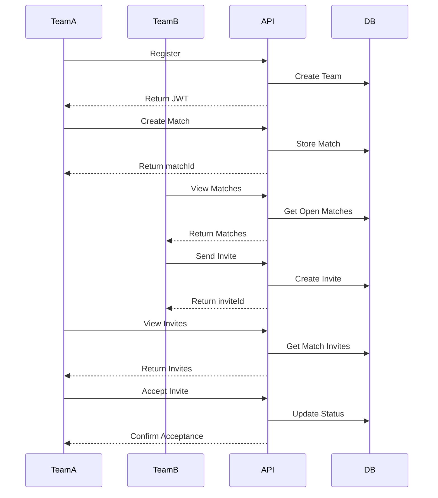

# Football Match Request System Guide

## Overview
This guide explains how to use the Football Match Request System, which allows college football teams to create matches, send invites, and manage their football games.

## Authentication
All routes (except viewing public matches) require JWT authentication. Include the token in the Authorization header:
```
Authorization: Bearer <your_jwt_token>
```

## Real-World Example Scenario

### 1. Team Registration and Login
**Team A (MIT Warriors) wants to join the system:**
```http
POST /api/teams/register
{
  "teamName": "MIT Warriors",
  "collegeName": "Massachusetts Institute of Technology",
  "password": "securePassword123"
}
```
After registration, Team A logs in:
```http
POST /api/teams/login
{
  "teamName": "MIT Warriors",
  "password": "securePassword123"
}
```
Response includes JWT token for future requests.

### 2. Creating a Match Request
**Team A wants to host a match:**
```http
POST /api/matches
{
  "matchTime": "2024-01-20T14:00:00Z",
  "location": "MIT Football Field"
}
```
Response includes `matchId` (e.g., `65c1234567890abcdef12345`)

### 3. Viewing Available Matches
**Team B (Stanford Tigers) wants to find matches:**
```http
GET /api/matches
```
No authentication needed. Shows all open matches.

### 4. Sending an Invite
**Team B wants to join Team A's match:**
```http
POST /api/invites/65c1234567890abcdef12345
```
Uses the `matchId` from step 2. Response includes `inviteId` (e.g., `67f1a001ff16ef6c330b1bb0`)

### 5. Managing Invites
**Team A wants to see invites for their match:**
```http
GET /api/invites/match/65c1234567890abcdef12345
```
Uses the `matchId`. Only Team A can view these invites.

**Team B wants to see invites they've sent:**
```http
GET /api/invites/sent
```
Shows all invites sent by Team B.

**Team B wants to see invites they've received:**
```http
GET /api/invites/received
```
Shows all invites received by Team B.

### 6. Accepting an Invite
**Team A wants to accept Team B's invite:**
```http
PUT /api/invites/67f1a001ff16ef6c330b1bb0/accept
```
Uses the `inviteId` from step 4.

### 7. Viewing Personal Matches
**Team A wants to see their matches:**
```http
GET /api/matches/my-matches
```
Shows all matches where Team A is either creator or participant.

## ID Types and Their Uses

1. **Team ID (`teamId`)**
   - Automatically generated during registration
   - Used internally to identify teams
   - Retrieved from JWT token in authenticated requests
   - Format: MongoDB ObjectId (e.g., `507f1f77bcf86cd799439011`)

2. **Match ID (`matchId`)**
   - Generated when creating a match request
   - Used in:
     - Viewing match details
     - Sending invites to a match
     - Viewing invites for a specific match
   - Format: MongoDB ObjectId (e.g., `65c1234567890abcdef12345`)

3. **Invite ID (`inviteId`)**
   - Generated when sending an invite
   - Used in:
     - Accepting/rejecting invites
     - Viewing specific invite details
   - Format: MongoDB ObjectId (e.g., `67f1a001ff16ef6c330b1bb0`)

## Important Notes

1. **Authentication Flow**
   - Register → Login → Get JWT token
   - Include JWT token in all subsequent requests
   - Token expires after 7 days

2. **Match Status Flow**
   - `open`: Match is available for invites
   - `accepted`: Match has been accepted by a team
   - `completed`: Match has been played
   - `cancelled`: Match has been cancelled

3. **Invite Status Flow**
   - `pending`: Initial state when invite is sent
   - `accepted`: Invite has been accepted
   - `rejected`: Invite has been rejected

4. **Security Considerations**
   - Only match creators can view invites for their matches
   - Only invite receivers can accept/reject invites
   - Teams cannot send invites to their own matches
   - Teams cannot send multiple invites for the same match

## Best Practices

1. **Error Handling**
   - Always check response status codes
   - Handle 401 (Unauthorized) by refreshing JWT token
   - Handle 404 (Not Found) for invalid IDs
   - Handle 400 (Bad Request) for validation errors

2. **Data Validation**
   - Validate match times are in the future
   - Ensure location is provided
   - Check team names and college names are valid

3. **Rate Limiting**
   - Implement rate limiting for API calls
   - Handle 429 (Too Many Requests) responses

## Example API Flow Diagram

